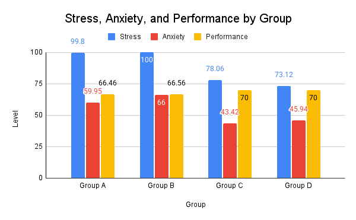
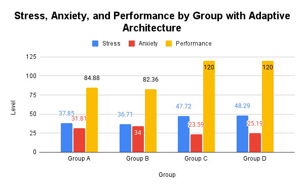
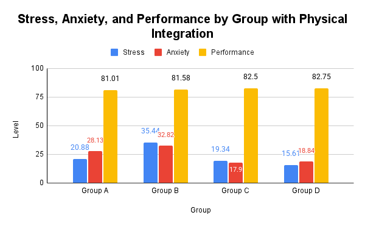
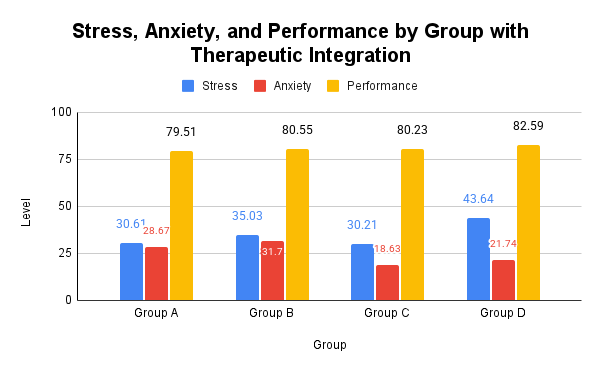

# Singulus Code
NSS Space Settlement Contest 2025

## Agent Experiment
This experiment simulates the psychology of humans in space.

To run the experiment, create a file called `.env` and copy and paste the following:
```
OPENAI_API_KEY=<enter API key here>
```

Optionally, you can set up a [Weights and Biases](https://wandb.ai/) to monitor training.

Run the following code in the terminal:
```
cd agent_experiment
pip install -r requirements.txt
python main.py
```

### Results
Below are the results of the agent experiment. The graphs below measure stress, anxiety, and performance among the AI agents.

Before the Implementation of Any Solutions:


Implementation of Adaptive Architecture:


Implementation of Physical Integration:


Implementation of Therapeutic Integration:


## Robot
Once the robot system is built and connected as instructed, go into the `robot` folder and upload `robotic_arm.ino` to the microcontroller.

## Vibration Controller
To run the vibration controller, run the following code in the terminal:
```
cd vibration_control
pip install -r requirements.txt
python main.py
```
## Laser Communication
Circuit building instructions can be found [here](https://www.instructables.com/Two-Way-Morse-Code-Communication-System/).

Once the laser communication system is built, go into the `laser_morse_comms` and upload `laser_communication.ino`
